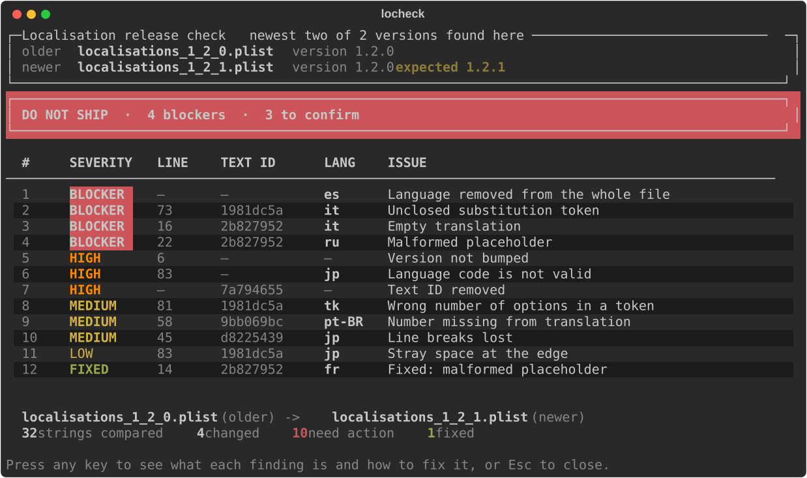

<div align="center">

# locheck

<p><strong>Tells a releaser which localisation changes could actually break the game.</strong></p>


<br>



<a href="#run-it">Run it</a>
&nbsp;·&nbsp;
<a href="#the-idea-it-rests-on">The idea</a>
&nbsp;·&nbsp;
<a href="#commands">Commands</a>
&nbsp;·&nbsp;
<a href="#in-ci">CI</a>
&nbsp;·&nbsp;
<a href="#what-it-does-not-catch">Blind spots</a>

</div>

Any key expands that into a card per finding with the file, the line, the English
source, the offending characters highlighted, and what to do about it.

---

## Why

`diff` already tells you what changed. On a Monday morning with a ship call to
make, the question is **which of those changes could break the game** — and the
answer is usually a handful, not the whole list.

On these two files, four strings changed and **two** deserve attention. A tool
that reported four would be worse than no tool: a releaser who sees one bogus
blocker learns it cries wolf, and the next real one gets waved through.

<a id="run-it"></a>

## Run it

**No terminal.** Double-click **`check-localisations.bat`**, or drag one or two
`.plist` files onto it. On a machine that has never run it, it offers to install
what it needs and carries on; if there is no Python at all it says where to get
one. The window stays open so the report can be read.

**Terminal.**

```bash
pip install -e .

locheck                        # compare the two newest versions in this folder
locheck new.plist              # compare it against the release before it
locheck old.plist new.plist    # spell both out
```

It reads the versions off the file names, so nobody has to remember which order
they go in. Getting that backwards is the worst failure available here — every
regression would read as a fix — so the report always states the pair it picked
and how many it chose between.

<a id="commands"></a>

## Commands

| | |
|---|---|
| `locheck` | the two newest versions in this folder |
| `locheck new.plist` | that file against the release before it |
| `locheck old.plist new.plist` | exactly these two, in this order |
| `--summary` | just the table |
| `--details` | the whole report at once, no keypress |
| `--all` | include problems that were already there |
| `--json` | structured output for CI or a dashboard |
| `--strict` | fail on anything flagged, not just blockers |

At a terminal: **any key** expands the detail, **`V`** compares a different pair
of versions, **`Esc`** closes. Piped or in CI it prints everything at once and
never prompts — a prompt in a build log is a hang, not a feature.

<a id="the-idea-it-rests-on"></a>

## The idea it rests on

Rules judge one string in isolation — *is this wrong right now?* — and know
nothing about the previous release. The engine runs **every rule twice**, against
the older file and against the newer, then compares:

| older | newer | verdict |
|---|---|---|
| fine | broken | **regression** — blocks the release |
| broken | broken | **pre-existing** — hidden by default |
| broken | fine | **fixed** — shown in green |

That is `engine._classify`, and it is the whole difference from a diff. It also
catches the trap in the sample data: French went `Commence dans % ...` →
`Commence dans %u...`. The placeholders changed, so a naive check screams — but
the old one was broken and the new one matches the source. Reported as **fixed**.

Adding a check is one predicate; the three-way classification comes free.

Pass an older file as the newer one and it detects the **rollback**, then rewords
the verdict, the headings and every finding for it. A crash that "was fixed"
shipping forward is one that *comes back* rolling back.

<a id="in-ci"></a>

## In CI

The gate is just running it. No wrapper, nothing to parse.

| exit | meaning |
|---|---|
| `0` | nothing blocking |
| `1` | blockers found, or `--strict` and anything flagged |
| `2` | files missing or unreadable |

Blockers fail the build. **HIGH findings deliberately do not** — those mean
"confirm this was intentional", which is a human call, and a gate that refuses
them teaches people to bypass the gate.

<details>
<summary><strong>Docker, Make, and the example workflow</strong></summary>

<br>

```bash
docker build -t locheck .
docker run --rm -v "$PWD:/files" locheck
docker run --rm -v "$PWD:/files" locheck --json
```

Exit codes pass straight through. The plist files are mounted rather than baked
in, so the image cannot end up checking its own stale copy.

I could not run Docker on the machine I built this on — it needs virtualisation
enabled, which was switched off — so rather than document it on trust,
[the workflow](.github/workflows/localisation-check.yml) builds the image and
runs it, asserting the container produces the same findings as the host and that
exit codes survive the container boundary. That job is the evidence.

`make` on its own lists the targets: `make dev`, `make test`, `make run`,
`make check`, `make docker`. Override the files with
`make check OLD=loc_2_0_0.plist NEW=loc_2_1_0.plist`.

</details>

---

<a id="what-it-does-not-catch"></a>

## What it does not catch

- **Whether a string fits its button.** It counts characters; real overflow needs
  font and widget width. Biggest gap, and the thing I want most.
- **Meaning.** A fluent mistranslation is invisible. So is a number attached to
  the wrong word: the Japanese pool rules say the multiplier decreases "to a
  maximum of 4" where the source says "to a minimum of 1.0". Every digit is
  present. No comparison of values reaches that.
- **Whether a removed text ID is still requested by a shipped client.**
- **`tk` is Turkmen; the strings are Turkish (`tr`).** Not flagged — `tk` is a
  valid code, catching it needs language detection, and it is in both files.
- Numbers below ten, and grapheme-vs-codepoint length for emoji.

<details>
<summary><strong>How I chose the checks, and the trade-offs</strong></summary>

<br>

Severity is **what the player experiences**, not how big the edit was: crash or
blank is a BLOCKER; a language vanishes or the release never lands is HIGH; wrong
or badly wrapped content is MEDIUM.

Twenty checks: placeholders (malformed, parity, order), empty strings, `A:[a/b]`
tokens (unbalanced, missing, wrong option count), languages dropped from a key or
the whole file, removed or duplicated text IDs, entries with no `en-US`, an
unbumped version, invalid language codes, translations left stale by a reworded
source, partial language coverage, missing numbers, lost line breaks, length
outliers, and stray whitespace at a string's edges.

**Trade-offs:**

- **One finding per string**, other problems attached to it. One row in the table
  (the ship/no-ship count), all of them in the card (the fix).
- **Numbers below ten ignored.** The check flagged the Turkish pool rules, which
  write "Rack 1"/"Rack 2" as *İlk üçgen*/*İkinci üçgen* — a correct translation
  reported as broken. Costs a dropped `0.5`; keeps MEDIUM worth reading.
- **A `%` after a digit is a percent sign.** `50% off` was being reported as a
  type clash. Every real corruption here has a *letter* before the sign.
- **Only two-letter language codes judged.** `fil` and `haw` have no two-letter
  form.
- **Pre-existing problems hidden** (`--all` shows them). Real, but showing them at
  release time is how a checklist becomes noise.
- **Ambiguity refused, not guessed.** A confident report about the wrong pair of
  files is worse than a question.

</details>

<details>
<summary><strong>Smallest version, what came after, and what I would do next</strong></summary>

<br>

**v1** was the diff engine, four blocker checks and the fixed/pre-existing
classification — already above the floor. I built the classifier *first* because
leaving it out is how the tool becomes noise. Then line numbers and fix
instructions; the quieter content checks; a corpus of *correct* localisation
content asserted to stay silent; the summary-first view; and file discovery so it
runs with no arguments.

**Deliberately not done:** config files, per-check toggles, a plugin system, a web
UI, spell-checking, language detection. Twenty checks do not need a framework — a
teammate adds one by writing a function that returns a `Problem` and appending it
to a list. I also stopped adding checks: falling catch rate, rising false-positive
risk, and I hit that cost twice in one afternoon.

**With another day:**

1. **Feed it the UI.** Component widths would turn the length heuristic into a
   real overflow check. The one gap that matters.
2. **Compare against production**, not the second-newest file.
3. **Post the summary to the release channel** on every candidate build.

</details>

<details>
<summary><strong>Assumptions</strong></summary>

<br>

`en-US` is the source. Strings are format-processed, so a bare `%` is a risk.
`\n` is a literal backslash-n. Filenames carry versions.

The tool never says a file is **live**: it can see which version is older, not
which one production is serving. A build can be cut and never shipped. So the
report labels the two files `older` and `newer`, states which pair it picked and
how many it chose between, and `V` re-picks interactively.

</details>

---

## Tests

```bash
pip install -e ".[dev]"
pytest
```

303 of them. The ones that matter are not the coverage: they are
[`test_false_positives.py`](tests/test_false_positives.py), a corpus of
localisation content that is **correct** — European decimal commas, promo
percentages, CJK, right-to-left script, emoji, markup — asserted to produce
nothing. If a case there starts failing, the tool has become noisier, which is a
regression even though nothing crashed.

See [FINDINGS.md](FINDINGS.md) for what it found in `localisations_1_2_1.plist`,
and [AI_USAGE.md](AI_USAGE.md) for how this was built.
